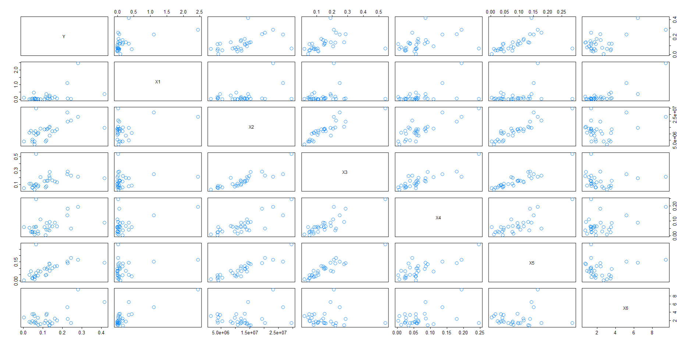
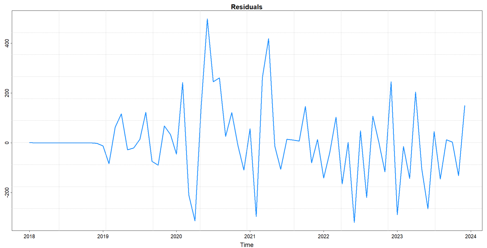
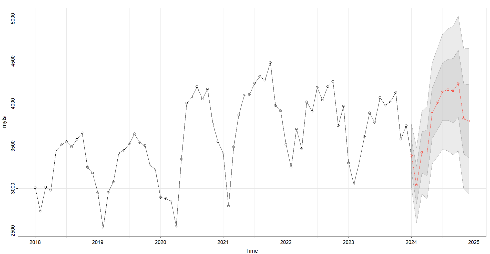
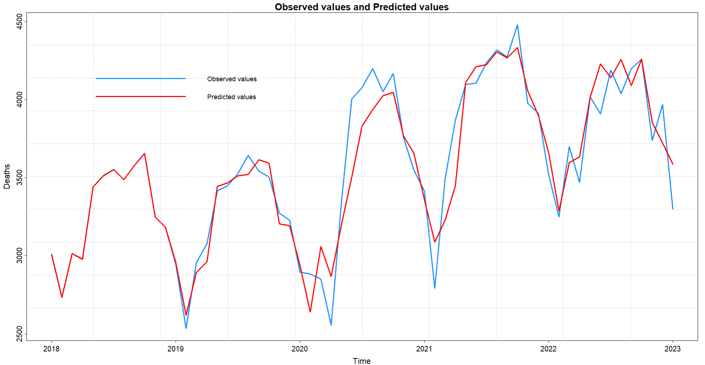

# Statistical Modeling and Forecasting Portfolio

This repository contains a collection of statistical analysis projects focusing on **Multiple Linear Regression** and **Time Series Forecasting (SARIMA)**. The projects demonstrate the end-to-end process of data modeling, from exploratory data analysis (EDA) to model selection and prediction, implemented in both **Python** and **R**.

## 📂 Repository Structure

- **Code:**
  - `multiple_linear_regression.py`: Python implementation of the regression analysis.
  - `sarima_forecasting.py`: Python implementation of the SARIMA time series forecasting.
  - `statistical-modeling-and-forecasting.R`: The original implementation in R language covering both tasks.
- **Data:**
  - `final-project-30firms.csv`: Dataset for the regression analysis.
  - `Motor-vehicle_deaths_2018-2023.csv`: Monthly data for the time series forecasting project.
- **Visualizations:**
  - `1. scatter-matrix-plot.png`, `residuals-plots.png`, `predicted-vals.png`, `forecasting.png`.

---

## 📊 Project 1: Multiple Linear Regression Analysis

**Objective:** To analyze the relationship between financial metrics (Variables X1-X6) and the target performance indicator (Y) for 30 firms.

### Key Steps:
1.  **Exploratory Data Analysis:** Visualized correlations using Scatter Matrix Plots.
2.  **Model Fitting:** Built a Multiple Linear Regression model using OLS (Ordinary Least Squares).
3.  **Feature Selection:** Identified key predictors and refined the model based on p-values.
4.  **Diagnostics:**
    - Checked for **Multicollinearity** using Variance Inflation Factor (VIF).
    - Analyzed residuals (QQ-plot, Residuals vs. Fitted) to ensure assumptions of normality and homoscedasticity are met.

### Visualizations

*Figure 1: Scatter Matrix Plot showing correlations between variables.*

---

## 📈 Project 2: Time Series Forecasting with SARIMA

**Objective:** To model and forecast monthly motor vehicle deaths (2018-2023) using Seasonal ARIMA (SARIMA) models.

### Key Steps:
1.  **Trend & Seasonality Analysis:**
    - Decomposed the time series to identify trend and seasonal patterns.
    - Applied differencing ($d=1$) and seasonal differencing ($D=12$) to achieve stationarity.
2.  **Model Selection:**
    - Analyzed ACF and PACF plots to estimate model parameters.
    - Selected the best model **SARIMA(0, 1, 2)x(1, 1, 1, 12)** based on AIC/BIC criteria.
3.  **Forecasting:** Generated forecasts for the next 12 months with confidence intervals.

### Results & Diagnostics
| Residual Analysis | Forecast Results |
|:---:|:---:|
|  |  |

*Figure 2: Comparison between observed data and model predictions.*

---

## 🛠️ Tech Stack & Libraries

- **Python:** `pandas`, `statsmodels`, `matplotlib`, `seaborn`, `scipy`
- **R:** `car`, `fpp2`, `astsa`
